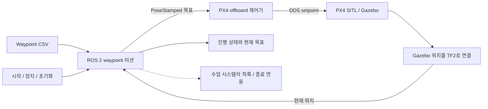

# ROS 2 UAV Waypoint Mission

**건국대학교 자율시스템플랫폼 수업의 CSV 기반 UAV 비행 미션입니다.**

[English](README.md) · [프로젝트 포트폴리오](https://steveandy-sudo.github.io/projects/uav-waypoint/) · [미션 코드](src/uav_waypoint_mission/uav_waypoint_mission/uav_waypoint_node.py) · [실행 안내](docs/SETUP.md)

3차원 waypoint 목록을 PX4 offboard 제어기의 목표 위치로 전달하는 미션 계층을 개발했습니다. TF2 위치 피드백으로 다음 지점으로 이동할 시점을 판단하며, 시작·위치 유지·초기화·진행 상태 인터페이스를 통해 통합 시뮬레이션에서 미션을 관찰하도록 구성했습니다.

| 기간 | 팀 | 개발 범위 | 환경 |
| --- | --- | --- | --- |
| 2026년 5–6월 | 4명 | UAV waypoint 미션과 제어기 연동 | ROS 2 Humble · PX4 SITL · Gazebo · TF2 · Micro XRCE-DDS |

## 결과와 근거

| 환경 | 근거 | 확인한 내용 |
| --- | --- | --- |
| 최종 수업 시연 | 순차 비행과 마지막 착륙에 대한 프로젝트 수행자의 확인 | **시뮬레이션에서 waypoint 미션과 착륙 완료** |
| 최종 작업공간 | 최종본으로 확인한 압축파일과 [출처 기록](docs/SOURCE_MAP.md) | 미션 및 ROS 연동 패키지 보존 |
| 경로 입력 | [목표 9개가 포함된 CSV](src/uav_waypoint_mission/config/waypoints.csv) | 미션 로직을 따라 읽을 수 있는 구체적 입력 |
| 오프라인 준비 검사 | [파일 일치, 문법, 패키지 정보와 경로 검사](docs/VALIDATION.md) | 수집한 소스 확인; SITL 재실행은 별도 작업 |

최종 시연은 수업의 통합 시스템에서 수행했습니다. 재실행에는 당시 시뮬레이터 자료와 실행 구성이 필요하며, 좌표와 착륙 인터페이스는 [실행 안내](docs/SETUP.md)에 정리했습니다. 반복 시험 성공률과 위치 오차의 정량 결과는 아직 없습니다.

## 시스템 구조



미션 노드는 **다음에 이동할 위치**를 선택하며, offboard 제어기는 이를 PX4 setpoint로 변환합니다. 점선은 수업 시스템의 종료 연동을 나타냅니다. 미션 노드는 착륙 요청을 발행하지만, 수집한 제어기에서 해당 요청의 수신 부분은 확인되지 않았습니다.

## 설계와 구현

| 문제 | 구현 | 확인할 이유 |
| --- | --- | --- |
| 경로 진행 | CSV 파싱과 3차원 목표 거리 비교 | waypoint 전환 조건을 명시적으로 관찰 가능 |
| 좌표 규약 | map/ENU 또는 초기 위치 기준 local NED 출력 | 제어기와 축·원점을 맞추어야 함 |
| 미션 제어 | 시작·정지·초기화·현재 위치 유지 | 미션 상태와 비행 제어를 구분하여 관찰 가능 |
| 종료 동작 | hold·land·disarm·land-then-disarm | 마지막 목표 도달과 실제 착륙 완료는 다른 사건 |

기본 설정은 **미션 루프 20 Hz**, **도착 허용 거리 1.0 m**입니다. 이는 설정값이며 측정된 비행 정확도가 아닙니다. 함께 보관된 제어기가 이미 ENU→NED 변환을 수행하므로, 미션의 local-NED 변환까지 함께 적용하면 축이 두 번 변환됩니다. 원점 정렬, TF 이름과 종료 처리 조건은 실행 안내에 정리했습니다.

## 코드 읽기 안내

| 구성 | 주요 코드 |
| --- | --- |
| 미션 상태·waypoint 선택 | [미션 노드](src/uav_waypoint_mission/uav_waypoint_mission/uav_waypoint_node.py) |
| 매개변수·토픽 연결 | [미션 launch](src/uav_waypoint_mission/launch/waypoint_mission.launch.py) |
| 경로 입력 | [Waypoint CSV](src/uav_waypoint_mission/config/waypoints.csv) |
| 목표 위치–PX4 연동 | [Offboard 제어기](src/px4_ros_com/src/examples/offboard/offboard_control.cpp) |
| 시뮬레이터 위치 피드백 | [위치–TF 브로드캐스터](src/gazebo_env_setup/src/pose_tf_broadcaster.cpp) |

## 빌드와 연동

`uav_waypoint_mission`, `px4_ros_com`, `px4_msgs`, `gazebo_env_setup`의 네 패키지를 포함합니다. 의존성이 설치된 ROS 2 Humble 환경에서 미션 패키지를 빌드합니다.

```bash
source /opt/ros/humble/setup.bash
colcon build --base-paths src/uav_waypoint_mission
source install/setup.bash
```

전체 실행에는 PX4 SITL, 수업용 Gazebo 월드·모델, Micro XRCE-DDS와 호환되는 TF·제어기가 필요합니다. 보관된 Gazebo 패키지는 `gz-msgs10`, `gz-transport13`을 요구합니다. 원본 소스와 launch 기본 설정은 유지했습니다.

- **재실행:** [빌드·좌표·TF·종료 연동](docs/SETUP.md)
- **결과 확인:** [시연 및 재실행 기록](docs/EXPERIMENTS.md) · [검증 기록](docs/VALIDATION.md)
- **출처 확인:** [원본 압축파일과 수집 범위](docs/SOURCE_MAP.md)

## 개발을 통해 얻은 관점

미션과 제어기가 같은 목표를 같은 축·원점으로 해석하는지, 도착 판정을 관찰할 수 있는지, 마지막 목표 이후 비행 시스템의 착륙 동작으로 연결되는지가 핵심 연동 문제였습니다. 이 인터페이스를 기준으로 재현 가능한 실행과 후속 위치 오차 분석을 구성할 수 있습니다.
