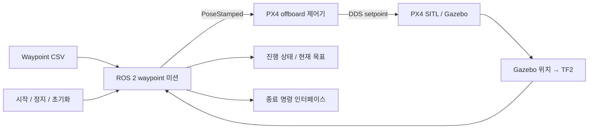

# ROS 2 UAV Waypoint Mission

**CSV 기반 3차원 경로, TF2 위치 피드백, PX4 offboard 제어를 연결한 Gazebo 비행 미션입니다.**

[English](README.md) · [프로젝트 포트폴리오](https://steveandy-sudo.github.io/projects/uav-waypoint/) · [핵심 구현](src/uav_waypoint_mission/uav_waypoint_mission/uav_waypoint_node.py) · [실행 안내](docs/SETUP.md)

waypoint 목록을 PX4 offboard 제어기의 목표 위치로 전달하는 ROS 2 미션 패키지를 개발했습니다. TF2로 UAV의 현재 위치를 확인하고, 목표까지의 3차원 거리로 도착 여부를 판단해 다음 지점으로 전환합니다. 시작·정지·초기화 명령과 진행 상태를 제공하여 수업의 통합 시뮬레이션 환경에 연결했습니다.

| 항목 | 내용 |
| --- | --- |
| 수업 | 건국대학교 자율시스템플랫폼 |
| 기간 | 2026년 5–6월 |
| 팀 규모 | 4명 |
| 개발 범위 | UAV waypoint 미션 및 제어기 연동 |
| 환경 | ROS 2 Humble · PX4 SITL · Gazebo · TF2 · Micro XRCE-DDS |
| 최종 시연 | 시뮬레이션에서 waypoint 순차 비행과 최종 착륙 완료 |

## 주요 결과

최종 수업 시연에서는 `uav_waypoint_mission`을 PX4 SITL/Gazebo 통합 시스템에 연결하여 waypoint를 순서대로 통과하고 마지막 착륙까지 완료했습니다. 이 저장소의 원본 압축파일은 당시 사용한 최종본으로 확인했습니다.

미션 패키지와 ROS 연동에 필요한 코드를 함께 정리했으며, 포함된 경로 파일에는 **waypoint 9개**가 들어 있습니다. [실험 기록](docs/EXPERIMENTS.md)에는 최종 시연 결과와 이번 코드 정리 과정에서 수행한 검사를 구분해 기록했습니다.

## 핵심 개발 내용

- **Waypoint 실행:** CSV 위치·yaw 입력, 순차 목표 선택, 3차원 거리 기반 도착 판단, 허용 오차 설정.
- **위치·좌표 처리:** TF2 위치 추적, 대체 UAV 프레임 조회, 제어기 인터페이스에 맞춘 map/ENU 및 초기 위치 기준 local-NED 출력.
- **미션 상태 관리:** 시작·정지·초기화, 현재 위치 유지, 진행 상태 및 현재 목표 발행.
- **종료 동작:** hold·land·disarm·land-then-disarm 옵션. land-then-disarm 경로에서는 고도를 확인한 뒤 disarm을 요청합니다.
- **시스템 연동:** `PoseStamped` 명령을 offboard 제어기로 전달하고, 선택적으로 waypoint별 짐벌 pitch를 발행합니다.

## 시스템 흐름



미션 계층은 **다음에 이동할 목표**를 결정하고, offboard 제어기는 입력을 PX4 setpoint로 변환합니다. 이 과정에서 좌표축·원점과 TF 구성을 일치시키는 것이 중요합니다. 함께 보관한 제어기는 ENU→NED 변환을 수행하므로, 미션 launch의 기본 설정과 어떻게 맞출지는 실행 안내에 정리했습니다.

## 코드 읽기 안내

| 파일 | 확인할 내용 |
| --- | --- |
| [미션 노드](src/uav_waypoint_mission/uav_waypoint_mission/uav_waypoint_node.py) | CSV 파싱, 좌표 변환, 목표 도착 판단, 상태 전환 |
| [미션 launch](src/uav_waypoint_mission/launch/waypoint_mission.launch.py) | 실행 매개변수와 토픽 연결 |
| [Waypoint CSV](src/uav_waypoint_mission/config/waypoints.csv) | map 좌표계의 9개 목표 및 yaw·짐벌 정보 |
| [Offboard 제어기](src/px4_ros_com/src/examples/offboard/offboard_control.cpp) | 목표 위치 입력, 좌표 변환, PX4 메시지 발행, disarm 고도 조건 |
| [위치–TF 연결](src/gazebo_env_setup/src/pose_tf_broadcaster.cpp) | Gazebo 모델 위치를 ROS TF로 전달하는 과정 |

## 구성과 실행

`src/uav_waypoint_mission`에 미션 구현을, `src/px4_ros_com`, `src/px4_msgs`, `src/gazebo_env_setup`에 같은 작업 공간의 연동 코드를 모았습니다. 원본 파일은 그대로 유지했습니다.

ROS 2 Humble 환경에서 저장소 루트를 기준으로 미션 패키지를 빌드합니다.

```bash
source /opt/ros/humble/setup.bash
colcon build --base-paths src/uav_waypoint_mission
source install/setup.bash
```

미션 실행에는 PX4 SITL, 수업용 Gazebo 환경, DDS agent, TF 및 제어기가 함께 필요합니다. 좌표·종료 설정과 실행 순서는 [상세 실행 안내](docs/SETUP.md)를 참고하세요.

## 개발을 통해 다룬 문제

미션 상태 관리와 비행 제어를 연결하면서 목표 위치의 원점·좌표축, waypoint 도착 조건, 진행 상태의 관찰 가능성, 마지막 목표 이후 착륙 연동을 함께 다뤘습니다. 이 경험을 통해 개별 노드의 기능뿐 아니라 노드 사이의 인터페이스와 실행 조건까지 확인하는 과정을 익혔습니다.

[실험 기록](docs/EXPERIMENTS.md) · [원본 및 수집 범위](docs/SOURCE_MAP.md) · [검증 기록](docs/VALIDATION.md)
