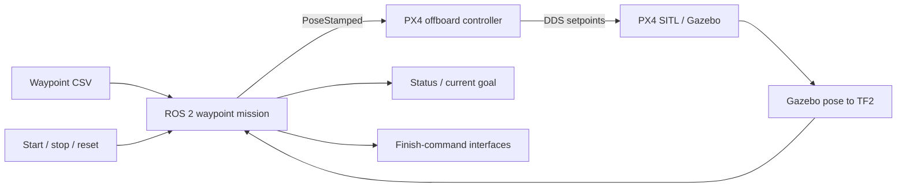

# ROS 2 UAV Waypoint Mission

**CSV-defined 3D missions, TF2 pose feedback, and PX4 offboard integration in Gazebo.**

[한국어](README.ko.md) · [Project portfolio](https://steveandy-sudo.github.io/projects/uav-waypoint/) · [Mission implementation](src/uav_waypoint_mission/uav_waypoint_mission/uav_waypoint_node.py) · [Setup](docs/SETUP.md)

I developed a ROS 2 mission package that turns a waypoint sequence into pose targets for a PX4 offboard controller. It tracks the UAV through TF2, evaluates arrival in three dimensions, advances to the next target, and exposes mission controls and progress for integration with the course simulation platform.

| Context | Details |
| --- | --- |
| Course | Autonomous System Platform, Konkuk University |
| Period | May–June 2026 |
| Team | Four members |
| Focus | UAV waypoint mission development and controller integration |
| Environment | ROS 2 Humble · PX4 SITL · Gazebo · TF2 · Micro XRCE-DDS |
| Final demonstration | Sequential waypoint flight and final landing completed in simulation |

## Outcome

The final course demonstration used `uav_waypoint_mission` within the integrated PX4 SITL/Gazebo system. The UAV followed the waypoint sequence and completed the final landing. The archived workspace was confirmed as the final demonstration version.

The repository preserves the mission package and its ROS-side integration dependencies. The included route contains **nine waypoints**. [Experiment notes](docs/EXPERIMENTS.md) distinguish the reported demonstration from the checks performed when collecting this repository.

## Development focus

- **Waypoint execution:** CSV position and yaw input, sequential goal selection, 3D distance checks, and configurable arrival tolerance.
- **Pose and coordinate handling:** TF2 feedback, fallback UAV frames, map/ENU output, and origin-relative local-NED output for different controller interfaces.
- **Mission lifecycle:** start, stop, reset, position hold, progress messages, and current-goal publication.
- **Finish behavior:** hold, land, disarm, and land-then-disarm options; the land-then-disarm path checks altitude before requesting disarm.
- **Integration and observation:** `PoseStamped` commands to the offboard controller, optional waypoint-specific gimbal pitch, and a launch configuration for simulation.

## System flow



The mission layer decides **which target comes next**; the offboard controller converts commands into PX4 setpoints. Matching coordinate conventions and the launch-time TF tree is central to this interface. The archived controller performs ENU-to-NED conversion itself; the setup notes explain how this differs from the mission launch default.

## Code guide

| Start here | What to read |
| --- | --- |
| [Mission node](src/uav_waypoint_mission/uav_waypoint_mission/uav_waypoint_node.py) | `load_waypoints`, `make_command_pose`, `timer_callback`, start/stop/reset callbacks |
| [Mission launch](src/uav_waypoint_mission/launch/waypoint_mission.launch.py) | Runtime parameters and topic connections |
| [Waypoint CSV](src/uav_waypoint_mission/config/waypoints.csv) | Nine map-frame targets, yaw and optional gimbal pitch |
| [Offboard controller](src/px4_ros_com/src/examples/offboard/offboard_control.cpp) | Pose input, ENU/NED conversion, PX4 messages, altitude-conditioned disarm |
| [Pose-to-TF bridge](src/gazebo_env_setup/src/pose_tf_broadcaster.cpp) | Gazebo model poses exposed in the ROS TF tree |

## Repository structure

```text
src/
  uav_waypoint_mission/  # Main mission implementation
  px4_ros_com/           # Archived offboard controller and transform utilities
  px4_msgs/              # Message definitions from the same workspace
  gazebo_env_setup/     # Simulation bridges, TF and launch configuration
docs/
  SETUP.md              # Build, interfaces and integration checks
  EXPERIMENTS.md        # Demonstration and reproduction record
  SOURCE_MAP.md         # Archive provenance and collection scope
  SOURCE_MANIFEST.csv   # Original paths, modes and SHA-256 hashes
  VALIDATION.md         # Checks performed on this collection
```

## Build the mission package

In a ROS 2 Humble environment, from this repository root:

```bash
source /opt/ros/humble/setup.bash
colcon build --base-paths src/uav_waypoint_mission
source install/setup.bash
```

Running a mission also requires PX4 SITL, the course Gazebo environment, the DDS agent, a working TF tree, and a compatible controller. See [setup and integration notes](docs/SETUP.md) before choosing coordinate and finish settings. The original source and launch defaults are preserved.

## Engineering lessons

The project connected a compact mission state machine to a larger flight stack. The key integration questions were the origin and axes of each pose command, when a target counts as reached, how to keep the current goal observable, and how mission completion connects to the landing controller.

[Source provenance](docs/SOURCE_MAP.md) · [Validation record](docs/VALIDATION.md)
