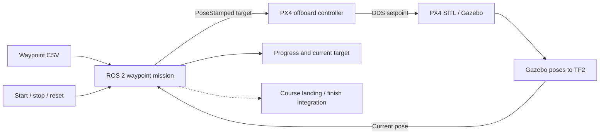

# ROS 2 UAV Waypoint Mission

**A CSV-driven flight mission for the Autonomous System Platform course at Konkuk University.**

[한국어](README.ko.md) · [Project portfolio](https://steveandy-sudo.github.io/projects/uav-waypoint/) · [Mission code](src/uav_waypoint_mission/uav_waypoint_mission/uav_waypoint_node.py) · [Setup](docs/SETUP.md)

The mission layer turns a list of 3D waypoints into position targets for a PX4 offboard controller. TF2 feedback determines when to advance to the next waypoint, while start, hold, reset, and progress interfaces make the mission observable within the integrated simulation.

| Period | Team | Development focus | Environment |
| --- | --- | --- | --- |
| May–June 2026 | 4 members | UAV waypoint mission and controller integration | ROS 2 Humble · PX4 SITL · Gazebo · TF2 · Micro XRCE-DDS |

## Results and evidence

| Setting | Evidence | Conclusion |
| --- | --- | --- |
| Final course demonstration | Project-author confirmation of sequential flight and final landing | **Waypoint mission and landing completed in simulation** |
| Final workspace | Author-confirmed archive; [source record](docs/SOURCE_MAP.md) | Final mission and supporting ROS packages preserved |
| Included route | [CSV with nine targets](src/uav_waypoint_mission/config/waypoints.csv) | Concrete input for reading the mission logic |
| Offline preparation checks | [File integrity, syntax, package metadata, and route checks](docs/VALIDATION.md) | Source collection checked; SITL replay remains a separate task |

The final demonstration used the integrated course system. A fresh replay needs the matching simulator assets and launch configuration; coordinate and landing interfaces are documented in [SETUP.md](docs/SETUP.md). No repeated-trial success rate or measured tracking-error result is available.

## System architecture



The mission node selects **where to go next**. The offboard controller translates the pose target into PX4 setpoints. The dashed finish path represents a course integration dependency: the mission publishes a landing request, while the corresponding receiver is not identified in the collected controller.

## Design and implementation

| Concern | Implementation | Reason to inspect it |
| --- | --- | --- |
| Route progression | CSV parsing and 3D target-distance comparison | A position criterion makes waypoint transitions explicit |
| Coordinate conventions | Map/ENU or initial-position-relative local NED output | Axes and origin must match the downstream controller |
| Mission control | Start, stop, reset, and current-position hold | Mission transitions can be observed independently of flight control |
| Completion | Hold, land, disarm, and land-then-disarm options | Reaching the final waypoint and completing landing are distinct events |

The source defaults to a **20 Hz mission loop** and **1.0 m arrival tolerance**. These are configuration settings, not measured flight accuracy. In particular, the archived controller already converts ENU to NED; applying the mission's local-NED conversion as well would convert the axes twice. The setup guide explains origin alignment, TF names, and completion handling.

## Code guide

| Component | Start here |
| --- | --- |
| Mission state and waypoint selection | [Mission node](src/uav_waypoint_mission/uav_waypoint_mission/uav_waypoint_node.py) |
| Parameters and topic wiring | [Mission launch](src/uav_waypoint_mission/launch/waypoint_mission.launch.py) |
| Route input | [Waypoint CSV](src/uav_waypoint_mission/config/waypoints.csv) |
| Target-to-PX4 interface | [Offboard controller](src/px4_ros_com/src/examples/offboard/offboard_control.cpp) |
| Simulator position feedback | [Pose-to-TF broadcaster](src/gazebo_env_setup/src/pose_tf_broadcaster.cpp) |

## Build and integration

The repository includes four packages: `uav_waypoint_mission`, `px4_ros_com`, `px4_msgs`, and `gazebo_env_setup`. Build the mission package in ROS 2 Humble with its dependencies installed:

```bash
source /opt/ros/humble/setup.bash
colcon build --base-paths src/uav_waypoint_mission
source install/setup.bash
```

A full run also needs PX4 SITL, the course Gazebo world/models, Micro XRCE-DDS, and compatible TF/controller interfaces. The archived Gazebo package requests `gz-msgs10` and `gz-transport13`. Source files and launch defaults remain unchanged.

- **Reproduce:** [Build, coordinates, TF, and finish integration](docs/SETUP.md)
- **Assess:** [Demonstration and proposed replay record](docs/EXPERIMENTS.md) · [Validation](docs/VALIDATION.md)
- **Trace:** [Source archive and collection scope](docs/SOURCE_MAP.md)

## Engineering takeaway

The central integration problem is agreement between nodes: the same target must mean the same axes and origin to both mission and controller, the arrival test must be observable, and mission completion must connect to the flight stack's landing behavior. These interfaces provide the structure for a reproducible replay and a future position-error analysis.
